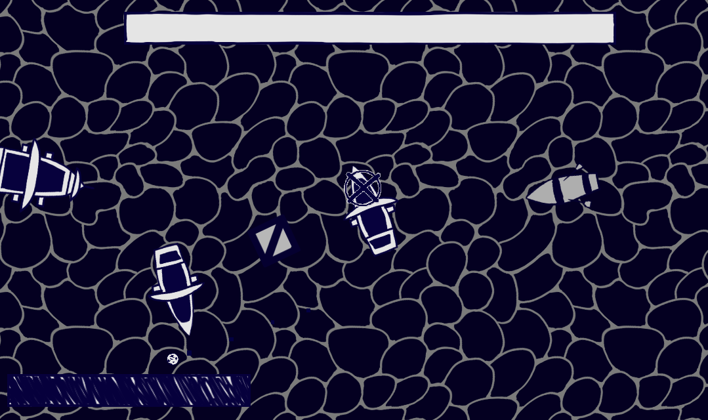
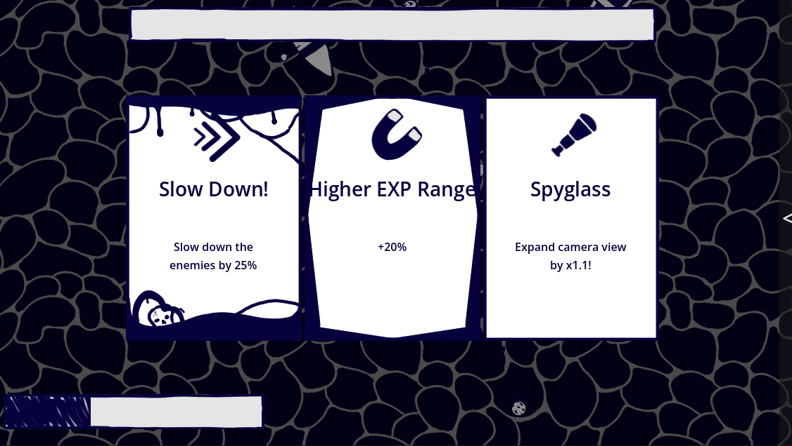

# PiratINK

A survival game where you steer a ship, fight off enemy waves and collect loot for as long as possible.

[Play it in your browser on Itch.io](https://martisos.itch.io/piratink)

## Quick Start
* **Move:** Left-click anywhere on the water to steer
* **Shoot:** Your cannons fire automatically
* **Upgrades:** Click to select a card when you level up

## Features
* **Smart enemy AI:** Enemy ships use pathfinding to hunt you down while avoiding crashes with each other
* **Card-based upgrades:** Pick from three random cards (Common, Rare, Epic, Legendary and Debuff) after each level up
* **Polished game feel** Screen shake, hit flashes, particle trails and customizable settings

## How it works
The game is made in Godot 4.7 using GDScript. One of the core focuses was implementing custom physics controllers and object interaction scripts so the enemy pathfinding feels natural without ships clumping together. The camera boundary systems also dynamically adjust if the player selects an upgrade that zooms out the view. 

## Credits
* **Music:** ["Infinity Crystal" pack by Sonatina.](https://sonatina.itch.io/infinity-crystal)
* **Event:** Made for [Hack CLub Stardance](https://stardance.hackclub.com)

## How to run it locally
* Download [Godot Engine (4.7)](https://godotengine.org/)
* Open the project folder in Godot
* Press **F5** to play!